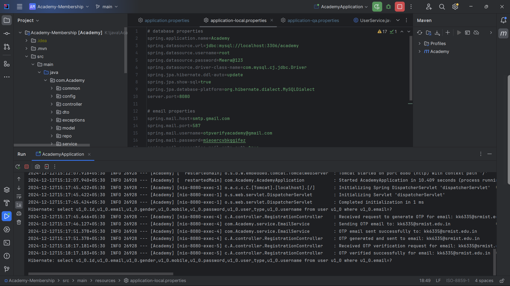

# Academy-Membership Backend

## Overview

The Academy Backend is the server-side implementation of the Academy Membership system, designed to manage user registration, OTP verification, and login processes. Built using **Spring Boot**, this backend integrates a robust **MySQL database** and a **Redis cache** for efficient OTP management. The backend exposes RESTful APIs for seamless interaction with the frontend and supports secure user authentication workflows.

---

## Features

- **User Registration**: Handles user data input and securely stores details in the database.
- **OTP Management**:
  - **Send OTP**: Generates and sends OTP to the registered email address.
  - **Verify OTP**: Verifies the OTP entered by the user within a valid timeframe.
- **Login Functionality**: Authenticates registered users with verified credentials.
- **Logs**: Logs user requests and application responses, viewable in the console.

---

## Technologies Used

- **Spring Boot**: Framework for backend development.
- **MySQL**: Relational database for user and application data.
- **Redis Cache**: Temporary storage for OTPs to enhance performance.
- **Postman**: API testing and validation tool.
- **Java**: Primary programming language.

---

## Prerequisites

- **Java 8 or higher**
- **MySQL** (version 8.x recommended)
- **Redis**
- **Postman** for API testing

---

## API Endpoints

### 1. Register User

- **Endpoint**: `/api/register`
- **Method**: POST
- **Description**: Registers a new user by saving their details in the MySQL database.
- **Payload**:

```json
{
  "name": "kishore",
  "email": "kishore@example.com",
  "mobile": "1234567890",
  "password": "securepassword"
}
```

- **Response**:

```json
{
  "message": "User registered successfully",
  "status": 200
}
```

---

### 2. Send OTP

- **Endpoint**: `/api/send-otp`
- **Method**: POST
- **Description**: Sends a One-Time Password (OTP) to the user’s registered email address.
- **Payload**:

```json
{
  "email": "kishore@example.com"
}
```

- **Response**:

```json
{
  "message": "OTP sent successfully",
  "status": 200
}
```

---

### 3. Verify OTP

- **Endpoint**: `/api/verify-otp`
- **Method**: POST
- **Description**: Verifies the OTP entered by the user.
- **Payload**:

```json
{
  "email": "kishore@example.com",
  "otp": "123456"
}
```

- **Response**:

```json
{
  "message": "OTP verified successfully",
  "status": 200
}
```

---

### 4. Login

- **Endpoint**: `/api/login`
- **Method**: POST
- **Description**: Authenticates a user and initiates a session.
- **Payload**:

```json
{
  "email": "kishore@example.com",
  "password": "securepassword"
}
```

- **Response**:

```json
{
  "message": "Login successful",
  "status": 200
}
```

---

## Configuration

### MySQL Database

- **URL**: `jdbc:mysql://localhost:3306/academy`
- **Username**: `root`
- **Password**: `Meera@123`

Update the `application.properties` file:

```properties
spring.datasource.url=jdbc:mysql://localhost:3306/academy
spring.datasource.username=root
spring.datasource.password=Meera@123
spring.jpa.hibernate.ddl-auto=update
```

---

### Redis Cache

Add Redis configurations in the `application.properties` file:

```properties
spring.redis.host=localhost
spring.redis.port=6379
spring.redis.timeout=60000
```

---

## How to Run the Application

1. **Clone the Repository**:
   ```bash
   git clone https://github.com/your-repository/academy-backend.git
   ```

2. **Navigate to the Project Directory**:
   ```bash
   cd academy-backend
   ```

3. **Install Dependencies**:
   Ensure Maven is installed and run:
   ```bash
   mvn clean install
   ```

4. **Set Up MySQL Database**:
   - Create a database named `academy`.
   - Update the `application.properties` file with your MySQL credentials.

5. **Set Up Redis**:
   - Install Redis and ensure it is running on the default port (6379).

6. **Run the Application**:
   ```bash
   mvn spring-boot:run
   ```

   The application will start at `http://localhost:8080`.

---

## Testing with Postman

1. **Import API Collection**:
   - Use Postman to import API collection JSON (if available).
   - Set the base URL to `http://localhost:8080`.

2. **Test API Endpoints**:
   - Verify registration, OTP, and login functionalities.
   - Test invalid cases (e.g., incorrect OTP, invalid login credentials).

---

## Logs and Debugging

Logs provide insights into API requests, responses, and errors. Logs can be viewed in the console or redirected to a log file using the `logback-spring.xml` file.

Sample Log Output:

```
2024-12-12T15:17:41.378  INFO 26928 --- [nio-8081-exec-5] c.A.controller.RegistrationController   : OTP generated and sent to kishore@example.com
2024-12-12T15:18:17.183  INFO 26928 --- [nio-8081-exec-1] c.A.controller.RegistrationController   : OTP verified successfully for email: kishore@example.com
```
 - 

---

## Future Enhancements

- Implement role-based access control (RBAC).
- Support multi-factor authentication (MFA).
- Add password recovery functionality.

---

## Contributors

- **Kishore**


